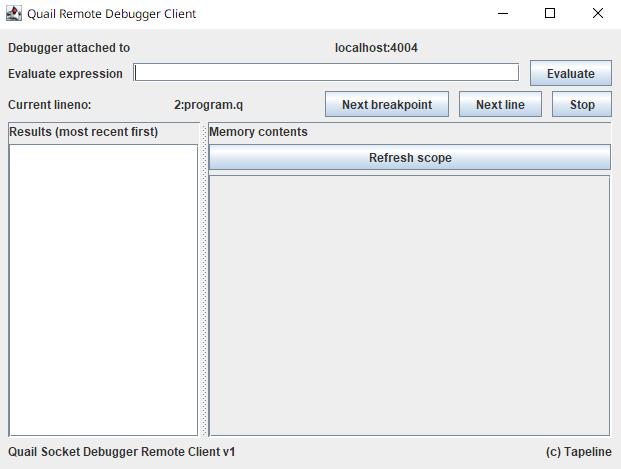

# Quail Specification
[Back to index](index.md)

<!-- TOC -->
* [Quail Specification](#quail-specification)
  * [Chapter 14: Debugging](#chapter-14-debugging)
    * [14.1 Definitions](#141-definitions)
    * [14.2 Quail debugger implementation](#142-quail-debugger-implementation)
      * [14.2.1 Connection specification](#1421-connection-specification)
        * [14.2.1.1 Stop](#14211-stop)
        * [14.2.1.2 Next line](#14212-next-line)
        * [14.2.1.3 Continue](#14213-continue)
        * [14.2.1.4 Memory](#14214-memory)
        * [14.2.1.5 Memory](#14215-memory)
      * [14.2.2 Debug server behaviour](#1422-debug-server-behaviour)
    * [14.3 Quail debugger usage](#143-quail-debugger-usage)
      * [14.3.1 Usage of Quail Debug Server](#1431-usage-of-quail-debug-server)
      * [14.3.2 Usage of QDK Debug Client (CLI)](#1432-usage-of-qdk-debug-client-cli)
      * [14.3.3 Usage of QDK Debug Client (GUI)](#1433-usage-of-qdk-debug-client-gui)
<!-- TOC -->

## Chapter 14: Debugging

### 14.1 Definitions

**<u>Breakpoint</u>** is a pair of *filename*-*line number* which specifies a 
location where debugger should pause the program

**<u>Debug server</u>** is a server that is launched within your Quail main
process and which handles breakpoints and other debugger commands

**<u>Debug client</u>** is a program that is launched separately and which
connects to debug server via a socket connection to deliver commands and
grab program execution data

### 14.2 Quail debugger implementation

#### 14.2.1 Connection specification
Debug server and debug client connect via sockets. Debug server should be
started first and only then debug client should be launched.

Debug server and debug client exchange messages via sockets. Messages are
strings (not binary) that are separated by `\n`. E.g. if you want to send
command `stop`, you should do:
```java
socketBufferedWriter.write("stop\n");
socketBufferedWriter.flush();
```
Following types of messages are supported (as of `2.0.0-alpha.6`):

##### 14.2.1.1 Stop
Syntax: `stop`

Semantics: forces the program execution to stop

##### 14.2.1.2 Next line
Syntax: `next`

Semantics: forces the program to resume execution and stop on the next line

##### 14.2.1.3 Continue
Syntax: `continue`

Semantics: forces the program to resume until it encounters another breakpoint

##### 14.2.1.4 Memory
Syntax: `mem`

Semantics: requests all contents of memory that are visible in current scope.

Returns messages: 
1. `memresult\n`
2. number of memory entries + 1 `\n`
3. memory entry encoded in base64. `\n`<br>
   When you decode it, you will get a string of the following format:
   `variable;value`.<br>
   Every memory entry is a separate message
   (which means that it is ended with `\n`)
4. `endmem\n`

Example:

Memory contains:
```
a = 15
b = 14
```
Request is:
```
mem
```
Answer is:
```
memresult
3
a;15        # but encoded in base64
b;14        # but encoded in base64
endmem
```

##### 14.2.1.5 Memory
Syntax: `eval` then code to evaluate encoded in base64 (in 2 separate messages)

Semantics: evaluate given expression in current runtime and scope

Returns messages:
1. `evalresult`
2. unencoded result

Expression is:
```
a = 14
```
Request is:
```
eval
a = 14       # but encoded in base64
```
Answer is:
```
evalresult
null         # since a = 14 does not return anything
```

#### 14.2.2 Debug server behaviour
If connection is lost, debug server fill stop and program execution will
continue as usual.

Filenames are interpreted only by Quail debug server, not by client, so
relative paths would be relative to QRE.

### 14.3 Quail debugger usage

#### 14.3.1 Usage of Quail Debug Server
To launch program in debug mode, change launch mode to `debug` 
(See [Chapter 12: Console operation](chapter12.md))

Default port for debugging will be 4004. To change it add a flag 
`-G.debugPort=PORT`.

After launch, Quail will not start the program until debug client
is connected

#### 14.3.2 Usage of QDK Debug Client (CLI)
CLI client could be launched from your QDK with the following command:
```
java -jar qdk.jar debugClient host port
```
Where host and port should be substituted with host and port on which the
Quail Debug Server runs. To connect to default address on which debug 
server runs write the following:
```
java -jar qdk.jar debugClient localhost 4004
```
When you launch CLI client, you will be asked to write breakpoints for files
in following format: 1 line per file, on each line you specify breakpoints
like this: `filename;line1;line2...` (e.g. `program.q;2;5;6`).

After that, when breakpoint is reached, a corresponding message will appear.

Now you can send following commands:
- `c` - continue
- `nl` - next line
- `stop` - stop
- `mem` - memory
- `eval` - eval

Learn more about debug commands in Chapter 14.2.1. 

#### 14.3.3 Usage of QDK Debug Client (GUI)
GUI client could be launched from your QDK with the following command:
```
java -jar qdk.jar debugClientGui
```
After that, you will be asked to provide address to connect

After entering address you should enter breakpoints in the same format as
in CLI client

After that you will see a GUI. 



In the first row connection information is displayed

In the second row you can enter an expression to evaluate (eval command).
The results of evaluation will appear in the list on the left

In the third row you see information about current breakpoint location
and can control the flow (commands: continue, next and stop)

On the right there is a table which will display memory contents (mem command)
